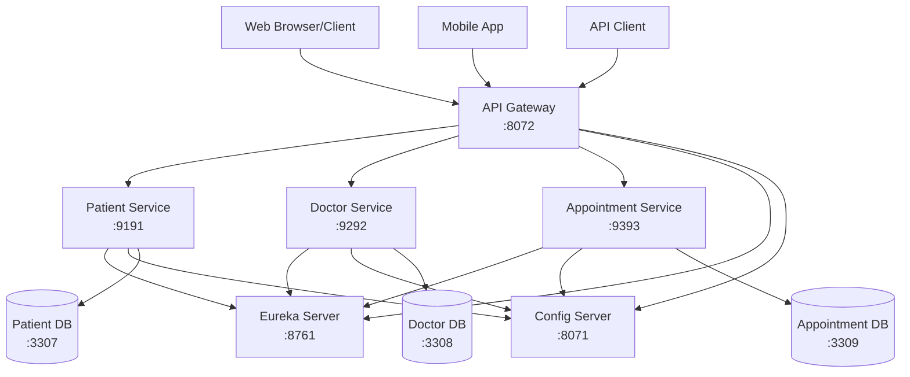
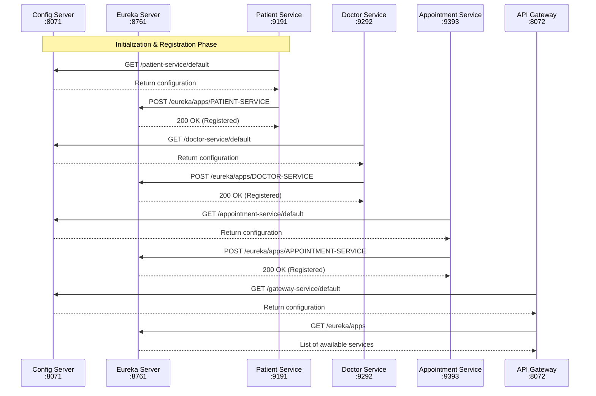
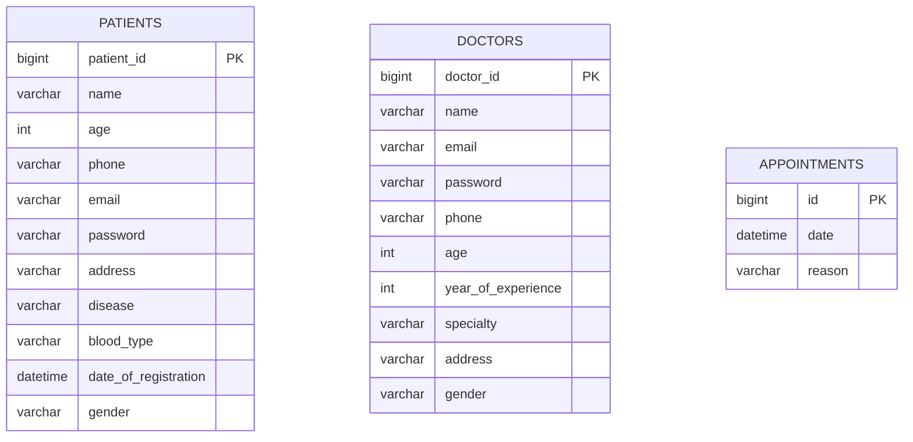
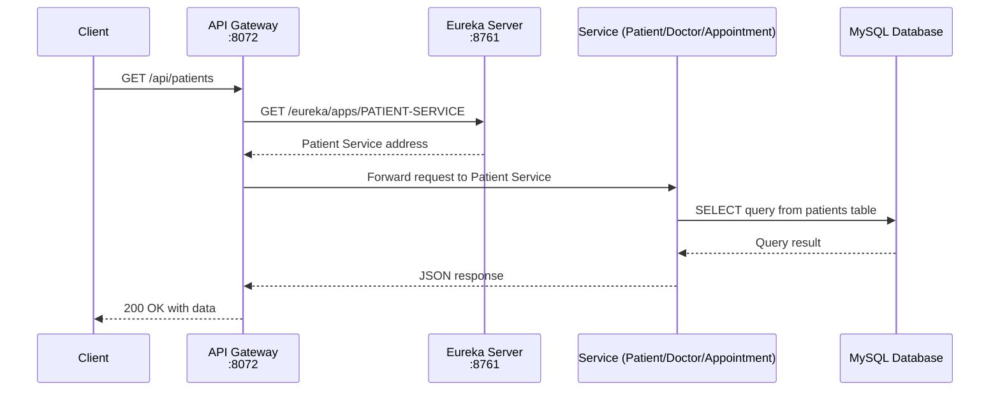
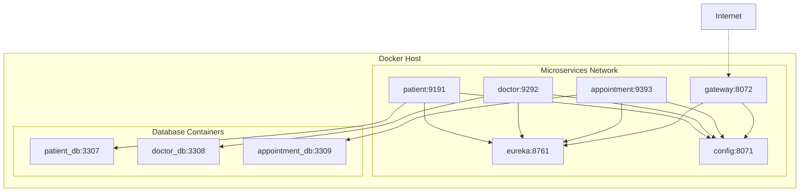

# 🏥 Hospital Management System - Microservices Architecture

This project is a **Hospital Management System** built using **Spring Boot Microservices** with **Eureka Discovery, Config Server, API Gateway, and Docker Compose**.  
It provides functionalities to manage **patients, doctors, and appointments** with separate databases for each service.

---

## 🚀 Features

- **Patient Management**: Add, update, delete, and search for patients.  
- **Doctor Management**: Manage doctors with specialization and years of experience.  
- **Appointment Management**: Book, update, cancel, and check appointment availability.   
- **Eureka Discovery**: Service registration and discovery.  
- **API Gateway**: Centralized routing for all services.  
- **Spring Cloud Config**: Centralized configuration management.  
- **MySQL Databases**: Separate DB for Patients, Doctors, Appointments.  
- **Swagger Documentation** for all services.  
- **Docker Compose Integration** to start all services easily.  

---

## ✅ Tech Stack

- **Java 17**  
- **Spring Boot 3**  
- **Spring Cloud Netflix Eureka**  
- **Spring Cloud Config**  
- **Spring Cloud Gateway**  
- **Spring Data JPA + Hibernate**  
- **MySQL**  
- **Docker & Docker Compose**  
- **Swagger / OpenAPI**  
- **Lombok**  

---

## 🏗️ System Architecture



---

## 🔄 Service Registration Flow



---

## 🗃️ Database Schema



---

## 📊 API Request Flow



---

## 🐳 Docker Deployment Architecture



---

## 🐳 Run with Docker

Clone the repository:

```bash
git clone https://github.com/Seif-Elsokary/Hospital-Management-System.git
cd Hospital-Management-System/docker-compose/default
```

Start all services using Docker Compose:

```bash
docker-compose up -d
```

This will start:
- 3 MySQL databases (patients:3307, doctors:3308, appointments:3309)
- Eureka Discovery Server (:8761)
- Config Server (:8071)
- API Gateway (:8072)
- Patient Microservice (:9191)
- Doctor Microservice (:9292)
- Appointment Microservice (:9393)

---

## 🌍 Services Endpoints

| Service        | Port | Endpoint                                                                         |
|----------------|------|----------------------------------------------------------------------------------|
| Patient MS     | 9191 | [http://localhost:9191/api/patients](http://localhost:9191/api/patients)         |
| Doctor MS      | 9292 | [http://localhost:9292/api/doctors](http://localhost:9292/api/doctors)           |
| Appointment MS | 9393 | [http://localhost:9393/api/appointments](http://localhost:9393/api/appointments) |
| Config Server  | 8071 | [http://localhost:8071](http://localhost:8071)                                   |
| Eureka Server  | 8761 | [http://localhost:8761](http://localhost:8761)                                   |
| API Gateway    | 8072 | [http://localhost:8072](http://localhost:8072)                                   |

---

## 📋 API Overview

### Patient Service
| Method | Endpoint              | Description          |
|--------|-----------------------|----------------------|
| GET    | `/api/patients`       | List all patients    |
| GET    | `/api/patients/{id}`  | Get patient by ID    |
| POST   | `/api/patients`       | Create a new patient |
| PUT    | `/api/patients/{id}`  | Update patient       |
| DELETE | `/api/patients/{id}`  | Delete patient       |

### Doctor Service
| Method | Endpoint             | Description         |
|--------|----------------------|---------------------|
| GET    | `/api/doctors`       | List all doctors    |
| GET    | `/api/doctors/{id}`  | Get doctor by ID    |
| POST   | `/api/doctors`       | Create a new doctor |
| PUT    | `/api/doctors/{id}`  | Update doctor       |
| DELETE | `/api/doctors/{id}`  | Delete doctor       |

### Appointment Service
| Method | Endpoint                 | Description             |
|--------|--------------------------|-------------------------|
| GET    | `/api/appointments`      | List all appointments   |
| GET    | `/api/appointments/{id}` | Get appointment by ID   |
| POST   | `/api/appointments`      | Create a new appointment|
| PUT    | `/api/appointments/{id}` | Update appointment      |
| DELETE | `/api/appointments/{id}` | Cancel appointment      |

---

## 📂 Project Structure

```
Hospital-Management-System/
│
├── configserver/          # Centralized configuration service
├── eurekaserver/          # Service registry
├── gatewayserver/         # API Gateway
├── patients/              # Patient microservice
├── doctors/               # Doctor microservice
├── appointments/          # Appointment microservice
├── docker-compose/        # Docker Compose setup
└── README.md              # Project documentation
```

---

## 🔧 Configuration

Each microservice has its own configuration file in the Config Server repository. The services are configured to connect to their respective databases:

- Patient Service: `patient_db` (port 3307)
- Doctor Service: `doctor_db` (port 3308)
- Appointment Service: `appointment_db` (port 3309)

---

## 🎯 Usage Examples

### Create a Patient
```bash
curl -X POST http://localhost:9191/api/patients \
  -H "Content-Type: application/json" \
  -d '{
    "name": "John Doe",
    "email": "john.doe@example.com",
    "phone": "123-456-7890",
    "address": "123 Main St, City, State",
    "dateOfBirth": "1990-01-01",
    "medicalHistory": "No significant medical history"
  }'
```

### Create a Doctor
```bash
curl -X POST http://localhost:9292/api/doctors \
  -H "Content-Type: application/json" \
  -d '{
    "name": "Dr. Jane Smith",
    "specialization": "Cardiology",
    "yearsOfExperience": 10,
    "email": "jane.smith@hospital.com",
    "phone": "555-1234"
  }'
```

### Book an Appointment
```bash
curl -X POST http://localhost:9393/api/appointments \
  -H "Content-Type: application/json" \
  -d '{
    "patientId": 1,
    "doctorId": 1,
    "appointmentDate": "2023-12-15T10:00:00",
    "notes": "Regular checkup"
  }'
```

---

## 🛠️ Development

To run services individually during development:

1. Start Eureka Server (port 8761)
2. Start Config Server (port 8071)
3. Start API Gateway (port 8072)
4. Start microservices in any order:
   - Patient Service (port 9191)
   - Doctor Service (port 9292)
   - Appointment Service (port 9393)

Each service will register itself with Eureka and fetch its configuration from the Config Server.

---

## 📝 License

This project is licensed under the MIT License - see the LICENSE file for details.

---

## 🤝 Contributing

Contributions, issues, and feature requests are welcome! Feel free to check [issues page](https://github.com/Seif-Elsokary/Hospital-Management-System/issues).

---

## 📧 Contact

Seif Elsokary - [seifsoliman809@gmail.com](mailto:seifsoliman809@gmail.com)

Project Link: [https://github.com/Seif-Elsokary/Hospital-Management-System](https://github.com/Seif-Elsokary/Hospital-Management-System)
